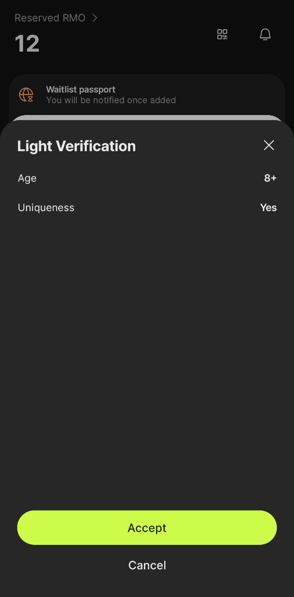

# Legal

Preparing for Terms of Service &amp; Privacy Policy

## General considerations

### Age limit

I think it's fine for us to support only users above 16 yrs old, since it's fundamentally a politics app.
Note that RariMe iOS app is only available to 17+ years old users. So I suppose, we can even limit ourselves to this, but 16 should be fine, no?

### Where do we launch?

For the February launch, we want to primarily launch to the US, Europe and its associated countries (the UK, Georgia, Ukraine...etc), and if possible to Canada, Australia and New Zealand. We also want to partially support Venezuela (just the passport, not phone number, see question below).

In terms of marketing we'll primarily target France, the US, Venezuela and Barcelona, through our network of partners.

Ideally, if possible, we'd support passports from any given origin country. It's technically trivial. We'd however not want to support every phone number country code. Just the ones mentioned above.

## Some important questions

- what constitutes "launching" to another country? Is it supporting users who own a phone number or a passport in the specific region? By using passport citizenship OR the country calling code? Or is it based on IP address origin only? The latter would be better for us from a business perspective. We want to be able to support Venezuela passport, but we don't want to support Venezuela phone numbers (we don't want to bear the risk of hosting identifying controversial data). For the US, Canada, and Europe, we want to support both phone numbers and passports.
- to make sure we are compliant in _not_ supporting a specific region, are we expected to ban / not serve our website if the user is using an IP address from that region? That seems unecessary? Our social app is freely accessible in read-only on the web, but tosince we won't support phone/passport for that region, it would be impossible for them to register/log-in anyway. I suppose we need to mention the target countries in the iOS and Android stores?
- how do we know the age of the users? we can verify that with passports, but not with phone numbers. Should we use some kind of consent mechanism? For the mobile apps, it's easy, it can be built-in the mobile app stores. But for the web, it's different.
- we should make it clear who is responsible for any eventual privacy breach if there is a flaws in the zero-knowledge proof math. The point of ZK cryptography and what we try to achieve with Agora is to design the app so that we don't collect personal data on the first place, unless it's strictly necessary for the service to function - and we work hard to provide this. But in case users can unfortunately be de-anonymized, for example because they don't use Tor and reveal their IP, or because they revealed their identity through sharing too many personal information in their writing, or through their style of writing, correlated with the attributes they shared from their passport and their other recorded actions. If law enforcement asks us, we will comply (no choice anyway), and if they can de-anonimize, they will and we should not be liable to the users. I think we should make it clear that we are not liable for these advanced privacy mechanisms in general: "use at your own risk".
- how can we warn the users of a Terms of Service or Privacy Policy change, since we don't collect email address systematically (only phone numbers OR ZKP from passport)? Is warning them mandatory by law? Can we just prompt them with a Dialog with a box "I agree" on the next login when/if they return to the app? For example, when we decide to broadcast all the data, not just proofs, we should probably NOT broadcast existing users data until these existing users have manually accepted the new Terms of Service?
- for the data that we don't collect yet, but we know we will do so, should we still put it in the Terms of Service and Privacy Policy, so we're forward thinking, and we don't have to change the documents for a while? Not collecting something that's mentioned seems OK to be, but not the opposite.

## Summary of our achitecture and data flow

### Current architecture diagram

In general, Agora is a classic client-server centralized application, with one-catch: we broadcast cryptographic proofs using the Nostr Protocol (and maybe later a p2p protocol called Waku).

Multiple clients (web app, iOS app, Android App), one server.

Currently, the server contains the following components, in the order the HTTP requests see them:
- Cloudflare proxy - I am not entirely certain, but I am pretty sure it records IP addresses (and maybe other metadata such as User-Agent and browser fingerprints). Role: protect against DDoS attacks.
- We MAY use AWS Gateway
- One simple AWS EC2 instance (logical server).
- AWS RDS is used to store the database. 
- AWS S3 is used for static assets and backups.
- AWS CloudWatch for log monitoring of the AWS EC2 Instance and the other AWS services. 
- AWS S3 assets will probably be replicated on servers worldwide (not backups, just assets such as images. Note that users cannot upload images, gifs or videos. It's going to be static images used on the app such as logos, etc.)
- Twilio to verify user phone number https://www.twilio.com/docs/lookup/v2-api/line-type-intelligence
- AWS Pinpoint and AWS SNS for sending one-time code via SMS/Voice/Messaging app
- AWS Pinpoint and AWS SES for sending one-time code via email
- AWS Pinpoint to send notifications
- All the AWS services are stored on servers based in Paris. A replica of this AWS infrastructure MAY be created and hosted on a US server, for performance reason.
- Other softwares as a service that we use (hosted in their own cloud):
    - A Hosted LLM (exact service to be defined)     
    - Apple Push Notification service (APNs) for notifications
    - Google Firebase Cloud Messaging (FCM) for notifications
    - Plausible for analytics: https://plausible.io/
    - https://capgo.app/ Capgo for hot mobile updates
    - ChatWoot https://www.chatwoot.com/ for client support (real time chat with users, report bugs, in-app FAQ)
    - Sentry for in-app crash reports and automatic frontend bugs detection https://sentry.io/

In general:
- we store data centralized in a PostgreSQL database like usual (AWS RDS)
- we try not to store/log IP addresses, but I wouldn't write this in the privacy policy / terms of service since Cloudflare use them to protect from DDoS anyway
- we also store all the cryptographic proofs in this database as well. Every HTTP requests are signed by the user device and cryptographically bound to the data using hashing (a specific public key has signed that they wanted to send a specific HTTP request with the body linked as a hash).
- in addition to storing the proofs to the PostgreSQL database, **we broadcast most of the cryptographic proofs to the Nostr protocol** (see details below). For that, we broadcast the proof from our backend to one to many Nostr Relay that's configurable on the client side. By default, we use the external nostr.lol (not sure for the exact relay, to be defined). One day we might run our own relay.
- in future, on top of supporting Nostr, we will probably broadcast the proof/data (configurable by users) to a peer-to-peer network (Waku https://waku.org/) from the server in our own infrastructure. Only valid data would be broadcast.
- we will also listen to data (proof+payload) broadcast to Waku, as an alternative way to post to Agora (instead of sending an HTTP request).

### Link to the Figma prototype (feel free to play with it)

https://github.com/zkorum/product

### Some screenshots of RariMe

Clicking on accept would generate the proof and send it to Agora.

Should RariMe add the following?:
- the URL of agoracitizen.network requesting the proof
- whether or not the nationality will be shared
- whether or not the sex will be shared
- ~~that the nullifier will always be shared?~~ probably not, since it is what "uniqueness" partially means?

### Accessing Agora

Use either:
- https://agoracitizen.network/feed/ on the web
- the Agora iOS app
- the Agora Android app (we will launch to Google Play Store but we may launch as well to F-Droid at some point)
- (in the future) send valid data directly / manually via the peer-to-peer Waku protocol.

### Authentication flow

#### Register

Users have the choice to use either
- phone number
- RariMe third-party app

to register.

#### Login

Users have the choice to use either
- phone number
- RariMe third-party app
- email (if associated with account)

to login.

#### Phone number flow (same for register & login)

Phone number registration and login work as follows:
- a user enters his country code and phone number
- Agora generates and sends the entered phone number a one-time code
- the user copies and pastes the one-time code on the Agora interface
- the user is now registered/logged-in

Behind the scene:
- upon entering their country-code and phone number, Agora frontend self-generates a public/private key pair (using standard WebCrypto API on the web, Android Keystore and iOS Keychain) and bind this authentication attempt to this keypair. Agora also generates a random one-time-code on the backend side, send it to the provided phone number, and wait for the user-entered code.
- upon entering the one-time code, Agora frontend signs the request with the above keypair
- as a result, Agora is able to associate this keypair with the given phone number (if the one-time code matches)
- now, every HTTP requests from the frontend are tranparently signed with this keypair under the hood, that's how Agora authenticates the user

Recorded information on Agora backend:
- phone number <--> public key ("did:key") <--> self-generated UUID on the backend side
- there may be several device public keys associated with the same UUID.
- cryptographic proofs - all the signed HTTP requests from the user public key

Security/privacy measure taken to secure the phone number:
- Agora keeps the country calling code in cleartext in the database, to serve the data analytics feature (demographic data)
- Agora keeps the last two digits of the phone number in cleartext in the database so as to present it to users in the form "+33******78" so they can recognize the phone number they have entered in the settings
- Agora chooses a "pepper" (app-wide cryptographic salt)
- Agora hashes the full E.164 phone number using the chosen pepper
- Agora keeps the hashed phone number in its database. Upon reception of the phone number for login purpose, it is hashed again and compared with this value, that's how Agora backend can associate login requests with existing accounts
- The full E.164 phone number is never cold-stored in cleartext, it only exists sporadically in the hot storage of the running backend application

Note that the phone numbers are still accessible to the Agora backend indirectly. The reason is, we know the "pepper", so we can relatively easily brute-force the hashes and know which accounts correspond to which phone number. It is not possible to solve this, otherwise the authentication with phone number would not work.

This safety measure (hashing mechanism) is however useful to prevent easy access from ZKorum employees to the phone numbers. It makes it more difficult for internal rogue employees to do harm carelessly, since they have to take conscious explicit measures to extract the phone numbers.

In case of database leak however, if both the pepper and the phone number hashes are leaked, then it is trivial for external attackers to brute-force the hashes and get access to the phone numbers. Note that salts and peppers are usually considered ~public information.

A similar approach is usually recommended to protect passwords (passwords are saved in hash forms using user-specific one-time salt instead of global pepper, but since we don't have a username/email to connect the authentication request to, we can't use the salt approach unfortunately).

##### Supported country phone number

- any EU country and associated countries (the UK, Georgia, Ukraine, Switzerland...etc)
- the US
- Canada

##### Other potential ways to send the one-time code

We may use:
- phone calls
- Messaging app messages (such as Whatsapp)

in addition to SMS as an optional alternative to send the one-time phone to the entered phone number.

#### RariMe authentication

RariMe registration and login work as follows:
- user is prompted to download the RariMe app and go through the onboarding on RariMe (scan one's physical biometrics passport)
- user is prompted to scan a QR code if on desktop, else to click on the "Verify" button
- user is redirected to the RariMe app and prompted to accept the proof (see screenshot below)
- upon proof acceptance, the proof is sent to Agora backend
- upon reception of the proof, Agora backend verifies the integrity of the proof, then associates the user with the "nullifier" generated in the proof. If the "nullifier" does not exist in our database, this is a registration. If the nullifier already exists, this is a login.

Note on the nullifier:
- unique identifier per eventId (public variable that's constant application-wide) generated as part of the zero-knowledge proof
- derived from the combination of the RariMe private key with a unique identifier in the passport: the same RariMe private key + passport unique identifier will always generate the same nullifier, given the same eventId
- a uniqueness check in the zero-knowledge proof makes sure the user can only associate a passport to a unique RariMe keypair
- unique per passport, however knowledge of the nullifier does not give knowledge of the passport unique identifier, nor does it give knowledge of the passport private key
- privacy guarantees are directly linked to keeping the RariMe private key... private.

What happens under the hood:
- a user clicks on "what is RariMe button"
- upon entering the "What is RariMe" page, Agora frontend self-generates a public/private key pair (using standard WebCrypto API on the web, Android Keystore and iOS Keychain). Agora then send a request to the backend to generate a verification link. The link contains a deep link to RariMe app. The backend records the request to associate this link with the public key generated above.
- the frontend polls the backend whether the proof corresponding to the user public key has been received or not every minute or so
- upon receiving the proof from the RariMe app, the backend updates its database with the following data received from RariMe:
    - nationality/citizenship (country of origin of the given passport)
    - sex (as written on the passport)
    - nullifier (as explained above, generated in the zero-knowledge proof)
    - and maybe in the future, the age group (exact groups to be defined)
- as a result, Agora is able to associate this keypair with the nullifier
- now, every HTTP requests from the frontend are tranparently signed with this keypair under the hood, that's how Agora authenticates the user

Recorded information on Agora backend:
- device public key (did:key:public_key) <--> RariMe generated nullifer <--> citizenship <--> sex <--> backend-generated user-specific UUID
- there may be several device public keys associated with the same UUID.
- bi-directional cryptographic proofs between Rarimo protocol and Agora-frontend-generated keypairs. This helps provide cryptographic verifiability: anyone can independently verify a user corresponds to some unique passport (but nobody can know which one exactly). It includes the raw ZKP received from Rarimo + a signed data from the device public key acknowledging this zero-knowledge proof. Note that the ZKP is bound to the device public key ("did:key"), this did:key is contained in the proof.

##### Authorized countries

Ideally we would allow passports from _any country_, if it's possible to launch like this without any terms of service/privacy policy for each specific country.

If it's not possible we will only accept proof from passport coming from the following countries:
- any EU country and associated countries (the UK, Georgia, Ukraine, Switzerland...etc)
- the US
- Canada
- Venezuela

Any proofs that would not verify this condition would be refused.

##### Age verification 

The zero-knowledge proof contain a proof of > 16yrs old (or 17?)

Any proofs that do not verify this condition are refused.

##### Zero-knowledge proofs 

How it works (this is done on RariMe side):
- first step is to "register" one's passport on a huge public Merkle Tree associated to a smart-contract
- then Agora receives proofs upon user acceptance.
- the government issuing the passport could do an enumeration attack and know who registered on the Rarimo protocol smart-contract
- however, it is improbable the issuing government would be able to know which passport used which app: the more people have registered to this smart-contract, the less likely the government would be able to be successful at a dictionary attack

More info (copied from Rarimo internal message to us):

--- 
Here is an update from our side regarding the light vs. full verification modes:
1. We've decided to handle the difference between full vs. light verification modes on the passport registration step. RariMe App will handle it seamlessly for the user.
2. Both types of passports are added to the same on-chain Merkle tree now, meaning the proof verification interface is also unified —no need to decide between light vs full flows anymore.
3. Both types of passports will benefit from plausible deniability against dictionary attacks.
4. The implementation is scheduled to be released in January.

You can learn more at: https://docs.rarimo.com/zk-passport/

---

How it impacts our own privacy policy or terms of service:
- we should probably mention the risk of dictionary attacks
- we should also mention that zero-knowledge proofs provide *application-level privacy*, not *transport-level privacy*. Transport-level privacy requires using a mixnet such as Tor.
- currently our app *does not natively integrate Tor*, therefore, the user must take extra step to protect their *transport-level privacy*
- however, we don't explicitely say that in our app. We talk about "verify anonymously" or "complete privacy" or "own your privacy" to refer to Rarimo log-in only.

### Log out

Logging out has the following impact (current implementation - may change in the future):
- the keypair is deleted from the app locally (web/ios/android)
- the backend keeps the locally deleted device public key in the database
- if kept, the keypair can log back in again

### User data generated and recorded on the app

The following info are associated with the users accounts in our server database.

Note that the app is freely visible on the web. All content (except certain personal data - see later section) is public in view-only. Only reacting requires log-in.

#### Username

- Users choose a username during onboarding. 
- a username is auto-generated for them if they don't want to choose one themselves.

#### Profile picture

- A profile picture is automatically chosen and associated with the user, using: https://boringavatars.com/ (it's locally rendered with SVG, the SVG are stored in our own PostgreSQL database).
- Users can edit their profile picture by choosing among existing options (won't make it for the initial release in Feb but will for sure be later implemented)
- Users cannot upload profile picture themselves.
- A profile picture must always be chosen, the field cannot be empty.

#### Topics (won't make it for the initial release in Feb but will for sure be later implemented)

- Users can follow topics
- These topics are associated with their accounts.
- Followed topics is a private information (kept only between the user and our server)
- Users can unfollow topics

#### "Views" actions (won't make it for the initial release in Feb but will for sure be implemented)

This is used for the future "For You" algorithm. The goal of this algorithm is to engage the users into seeing conversation on topics they are interested in, push conversations and topics that need more diverse opinions and reactions, and open the perspectives of the users to new topics.
- What the user viewed and at what time: 
    - conversations that appeared on their feed
    - conversations that they clicked on from their feed
    - conversations/opinions/replies that they clicked on from the link directly
    - opinions that they viewed on the conversations they opened
    - opinions that they clicked on to see the replies 
    - replies that they viewed on the opinions they opened
- Unlike mainstream social apps, users can opt out from the collection of this data. They can view and delete this information at any time. Doing so will affect the availability or pertinence of the "Discover" algorithm.

We may add more of this type of data, but it is a decent beginning.

#### Languages

- Agora frontend detects the language of the browser/device
- Users are prompted to select the languages they speak - with the language of the browser/device being the default
- These spoken languages are used to customize their feed with user-generated content in their own language and associated region
- Users can also configure the language of the application, which is by default the language of the browser/device. This information is used to translate the app to the user's language and to translate the user's content to the user's language by clicking the "Translate" button (feature not implemented yet)

#### Conversation

- Users can start a conversation (title + body - free text), that can optionally contain a poll

#### Opinion

- Users can add their opinion to a conversation (free text)

#### Reactions (won't make it for the initial release in Feb but will for sure be later implemented)

- Users can add emojis to an opinion (precise list to be defined)

#### Claps (won't make it for the initial release in Feb but will for sure be later implemented)

- Users can "clap" a conversation

#### Agree/Disagree 

- Users can agree or disagree on opinions.

#### Replies

- Users can "reply" to an opinion (free text).
- Opinion authors can reply to the replies they receive.
- Random users cannot reply to someone else's reply.

#### Upvote/Downvote

- Any logged-in user can upvote or downvote a reply.

#### Identity data in settings (won't make it for the initial release in Feb but will for sure be later implemented - for not users can just delete their account)

- Users can add a phone number at any time.
- Users can change their passport to another one at any time.
- Users can only delete their phone number if they add a passport first
- Users can only delete their passport data (nullifier, nationality, sex) if they add a phone number first
- Users can add an optional email address (won't make it for the initial release in Feb but will for sure be later implemented)
- Users can change or delete the email address they added (won't make it for the initial release in Feb but will for sure be later implemented)

#### Moderation settings (won't make it for the initial release in Feb but will for sure be later implemented)

- Users must choose between "Safe Space" or "Brave Space" by default during onboarding
- Users can choose this global setting in the menu
- Users can switch Safe Space/Brave Space per conversation

#### "Post as anonymous" (won't make it for the initial release in Feb but will for sure be later implemented)

- Users can choose to appear as "anonymous" or not when creating conversations/opinions/replies
- Upon posting as anonymous, the username is hidden and replaced by "anonymous", and the corresponding content does not appear publicly in the user profile. The profile picture is also replaced with the static "anonymous" one.
- In our database, we still link the user content with the user profile, we just don't show it in the frontend.
- To protect privacy, the proof of posting anonymously is also broadcast to the Nostr/P2P network. However, the proof that links the accounts together is not broadcast, ensuring privacy is maintained.
- Users cannot use emoji/claps/agree/disagree/upvote/downvote as "anonymous".

#### Notifications

- Users receive notification generated depending on the platform actions.
- Current notifications are: 
    - someone created an opinion to your conversation 
    - someone agreed/disagreed to your opinion
    - someone replied to your opinion
    - someone upvoted your reply
    - your moderation report was received / processed (will not make it for first release)
    - someone clapped your conversation (will not make it for first release)
- Notifications cannot be deleted, but the user can opt out from them (either mobile push notification, web push notification or in-app notification).

#### Reports

- Users can report conversations, opinions or replies

#### Flag

- Users can flag/unflag conversations, opinions or replies

#### Proofs

- all the signed data are always kept locally.
- most signed data are broadcast via Nostr Relay (see lists below)
- these proofs are not visible in the app - but anyone can download all the proofs for a given conversation, by clicking on a button
- signed data are:
    - every UCAN to every HTTP request, it contains the HTTP Method and HTTP Endpoint being called, the DID of the audience, the did of the issuer (the public key of the originating device that signs the UCAN), the time, the expiration date, and the hash of the HTTP body. All this data is signed with the key of the device currently logged-in.
    - the ZKP received from RariMe

Note that, UCAN uses a hash (one-way function) to hide the HTTP body - so it's just a proof, not the actual data. However, certain data are trivial to brute-force. For example, if the body is either "agree" or "disagree", then the sha256 hash will always be either "94d5c9d96025716090f176f76e07c45b1296250fe9bfe1823f77f53881548690" for "agree" or "67656def000fb9af9c1bd2459f92a20d3a778a56fc20660c81c2f8f424f91d8f" for disagree, so in that case it is trivial to deanonymize.

The broadcast signed data (= associated with a specific did:key) are the proof of the data that are used to generate the dashboard analytics, and populate the website public content. The following requests _proofs_ (not data at this point) are broadcast:
- authentication data:
    - bi-directional proofs with ZKP from RariMe
    - UCAN proving account creation / adding new device to a specific user. May require trusting Agora if not bound to a ZKP proof but a phone number. In this specific case, no body hash will be involved in the proof, to protect user's phone number.
- associating a UUID to a did:key (public key) - this is NOT broadcast for did:key used for "anonymous" posting 
- updating and associating a username to a did:key (public key and underlying account UUID/nullifier) - this is NOT broadcast for did:key used for "anonymous" posting
- create/edit/delete a conversation/opinion/reply including the one posted as "anonymous"
- react to an opinion/reply (emojis)
- cancel reaction to an opinion/reply
- report a conversation/opinion/reply
- flag a conversation/opinion/reply (including reply "this is misleading / this is antisocial")
- unflag an conversation/opinion/reply (reply "this is not misleading / this is not antisocial")
- agree/disagree on an opinion
- cancel agree/disagree on an opinion
- clap/unclap a conversation
- upvote/downvote a reply
- cancel upvote/downvote a reply
- delete account

UCAN that are never broadcast:
- "Views" requests
- Safe space/Brave space settings
- the proofs that link the identifiers used for anonymous posting with the identifier used for pseudonymous posting
- notifications / notification settings
- follow/unfollow topics

### Data visibility

#### Public data

Conversations/opinions/replies are shown with the date of creation / edit, and with the message "edited" if the content was edited.

These data are visible directly by anyone without any log-in from our website:
- users profile:
    - username
    - UUID
    - user profile picture
    - user nullifier (extracted from ZKP) & bidirectional identity proofs - if they have verified their passport
    - proof signed by Agora server bounding the did:keys to the user UUID - if they only verified the phone number
    - date the user joined the app
    - conversation/opinion/reply that are assigned to the username (not the ones created with "post as anonymous" option, those are only visible to the logged-in user that controls the given profile)
    - reactions (emojis)
    - agree/disagree actions
    - claps
    - upvotes/downvotes
    - the polls the user responded to
    - flagged/reported content by the user
    - all content include proofs
- feed:
    - conversations including proofs
- conversation page 
    - all the opinions as they appear 
    - all the replies as they appear 
    - all the reactions/agree/disagree/upvote/downvote/claps
    - all content include proofs

A "conversation" is shown with:
- date the conversation was created/last edited
- whether or not the conversation was edited
- the username of the user who authored the conversation OR "anonymous" if the user chose "Post as anonymous" option
- the profile picture of the user who authored the conversation OR a generic "anonymous" picture if the user chose "Post as anonymous" option
- the title of the conversation
- the body of the conversation
- the poll, if any

A poll is shown with:
- buttons to choose among the different options (max 6 in total)
- a button to see results
- a button to go back and choose among the options
- a button to change your choice

An "opinion" is shown with:
- date the opinion was created/last edited
- whether or not the conversation was edited
- the username of the user who authored the conversation OR "anonymous" if the user chose "Post as anonymous" option
- the profile picture of the user who authored the conversation OR a generic "anonymous" picture if the user chose "Post as anonymous" option
- the agree/disagree interaction button
- number/% of people having agreed
- number/% of people having disagreed

#### Private data only visible to the account the data belongs to

- Phone number
- Email address if any
- If phone verified, explicit phone country code and associated country (not displayed to the public in the UI, however the proof containing the information is downloadable client-side by anyone, and the proof is broadcast to Nostr/p2p on the backend side)
- If passport verified, explicit nationality and sex (not displayed to the public in the UI, however the ZK proof containing the information is downloadable client-side by anyone, and the proof is broadcast to Nostr/p2p on the backend side)
- Settings configuration (safe space/brave space setting)
- Followed topics
- "Views" information
- Languages information
- Conversations/Opinions/Replies posted as "anonymous" (they appear publicly including proof, but the *association* with a specific user is only shown to the said specific user)

### Control and user actions

- Users can undo:
    - their reactions
    - their claps
    - their upvote/downvote
    - their poll responses
    - their agree/disagree actions
    - following a topic (unfollow, at least 3 topics must be selected al all times)

- Users can delete:
    - their conversations
    - their opinions
    - their replies
    - their "views" information
    - the language spoken (at least one must remain)

Data that cannot be deleted except by deleting the account:
- cryptographic proofs (UCAN and passport ZKP)

To delete the passport proof (if a phone number has already been entered):
- the user must re-generate the proof with RariMe, containing only the nullifier (no nationality or sex)
- upon confirmation, the previous proof will be deleted together with the values "nationality" and "sex"
- however, the following proofs will never be deleted, even upon account deletion:
    - ZKP generated above to delete the passport data - containing the nullifier and other cryptographic materials but NOT "nationality" and "sex"
    - UCAN that signs this ZKP with the device public key
    - UCAN corresponding to the HTTP request to delete the passport data
- this is necessary to prove to third-party auditors that Agora did not censor specific accounts/data, we simply deleted the content as requested by the user (represented by its nullifier).

To delete the account:
- logged-in user who have verified their passport with RariMe must regenerate a proof, containing only the nullifier (no nationality or sex)
- logged-in user who have verified only their phone number must re-verify their phone number to confirm deletion their account

Upon the user confirming the deletion of their account:
- the account is marked to be deleted in 15 days
- the user is shown the text: "Your account is set to be permanently deleted in 15 days. Log back in at any time before this period to restore your account and cancel the deletion action."
- this action will trigger the future deletion all the user data including conversations, opinions, replies, reactions, upvotes/downvotes, agree/disagrees, claps, flags, reports and the corresponding proofs, with the following exceptions (these data will never be deleted):
    - the IDs of the user-generated content (opinion/conversation/replies/flags/reports/etc) will be kept so that it will not be re-used and it will show an appropriate message when clicking on the dead link. It is also useful to allow users to search by ID and audit our platform. It is also useful to make sure the UX is smooth for other members of the community that had reacted to the deleted account data.
    - the UUID will be kept so that it won't be reused
    - the history of all the did:keys (public key) by the specific accounts, with the UCAN binding all the did:keys together
    - the UCAN (signed data with device public key) corresponding to the HTTP request demanding to delete the given account identified by a UUID, counter-signed by our own server.
    - if users had verified their passport, the ZKP from RariMe that is bound to the device key demanding the deletion of the account. In this case, the ZKP only contains the nullifier and the device key, not the sex/nationality.
    - if users had verified their passport, the UCAN where the device key signs the ZKP from RariMe
- this is necessary to prove to third-party auditors that Agora did not censor specific accounts/data, we simply deleted the content as requested by the user.

In practice, undo/delete:
- only mark the item as deleted but do not delete it immediately, for security reasons

There is an automated cron job that's running every day and which actually delete data from the database upon verifying that the flag "deleted" is up (for at least 15 days if it's an account deletion, or immediately for other specific deletion requests).

Note on proofs (or data in the future) that were already broadcast to infrastructure we do not control (Nostr or Waku p2p network):
- we will broadcast the proofs that the user wants to delete the account/data
- however, we can't ensure that the external individuals or organizations listening and operating the Nostr Relays/p2p network will act and actually delete the proofs (or data if we broadcast data)

The action to edit conversation/opinion/reply:
- only add the new version to the database, but does not delete the old one, so we can make sure people are not saying the opposite they said after having had 10M agrees
- the whole history is marked as deleted upon deletion request

### Backup and retention policy

- Database is backed-up every day on AWS S3
- 30 days retention policy
- Deleted data may still exist in backups, until the backups are deleted.
- So at most, a data will stay in our database for 30 days after the deletion request is processed (so that means almost 31 days at most for content deletion request sent right after the cron job wakes up, and almost 46 days at most for account deletion request sent right after the cron job wakes up)

### How user data will later be processed (won't make it for the initial release in Feb but will for sure be later implemented)

Pol.is cluster:
- A machine learning algorithm will be used locally in AWS for each conversation
- This algorithm will create cluster representation, and these results are stored in our database
- the LLM is used to label each cluster and create AI summary. The result is stored in our database
- the app will display and visually represent these clusters
- users can locally navigate the cluster of opinions

Topics:
- the LLM is used to associate topics to each conversations

Automatic moderation labeler:
- an LLM is used to automatically flag/report potentially harmful content 

Dashboard, data analytics, monetization and API (==> UNDER DISCUSSION)
- We would use data analytics to infer data from multiple conversations to gather more insights. It includes for each user, to infer a "Political" profile based on the user account data across multiple conversations. Question: will this "Political" profile be available to the each user? Yes. Will be part of the upcoming reputation/gamification system. Users are in control of all their info so if they delete each of them, they can change the result of the algorithm. Every "anonymous" posts from a user will be treated as if it comes from a separate account, unrelated to the real author. This means it won't be used to link the "Political" profile to the user.
- Most collected data will be involved, including the country calling code, the passport proof, the conversations/opinions/replies created (including "anonymous" ones), the Reactions, the upvotes/downvotes, the Claps, the agrees/disagrees. The data that will NOT be involved will be the IP address and other metadata, the "Views" data, the phone number hash, the phone number last two digits, the email address, the Safe Space/Brave Space setting, the Notifications settings, the language settings and the Topics followed.
- We would provide dashboard analytics that can be filtered depending on the demographics \[sex/nationality (for users that verified their passport) or country inferred from the country calling code (for those who verified their phone)] and more information (cluster info, etc).
- Every involved individual account's posts and demographics ("country" and "sex", and later eventually "age group") used to calculate this dashboard will be available to the API/dashboard. That means any users can know the demographics of each account, given access to this API/dashboard. Issue with privacy? Tradeoff between privacy and transparency? Clients must trust us that our dashboard/analytics are correctly generated if we don't provide the demographics data on the first place. Plus, that wouldn't work with a more decentralized data approach.
- There is an exception with the above: "anononymous" conversation/opinion/reply will be used and available in the dashboard/API, and the underlying user demographics as well, however the information of which account the data belongs to will not be made available. Each "anonymous" data managed by a specific user will be treated as a separate account, diassociated from the real account they belong to.
- We would provide a chatbot, users can ask whatever they want to know about what is being debated
- This dashboard and chatbot will be released under a freemium model
- We would also sell HTTP API for paying clients wanting to do their own market research

